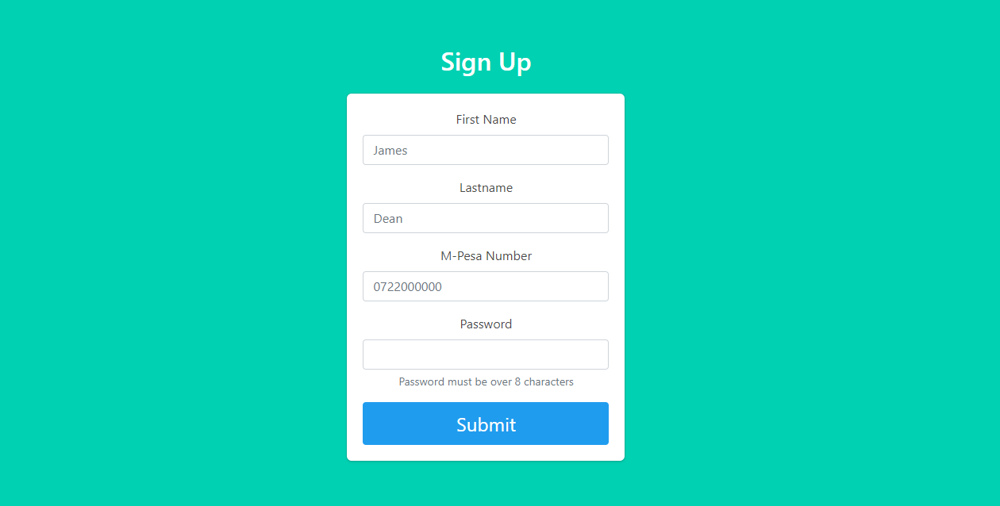
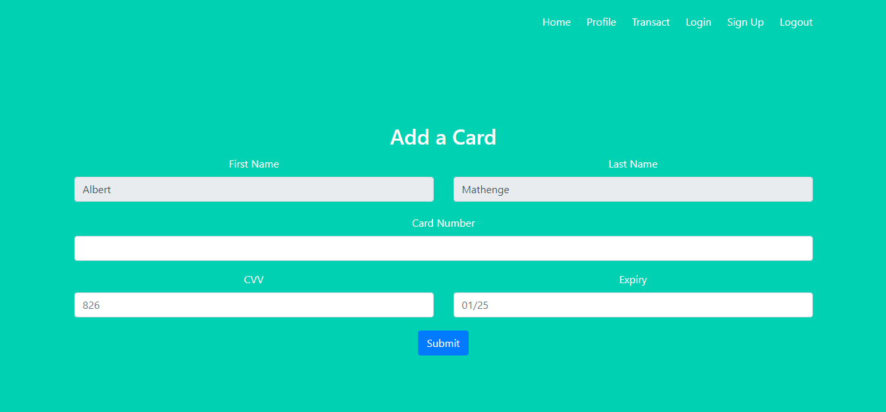
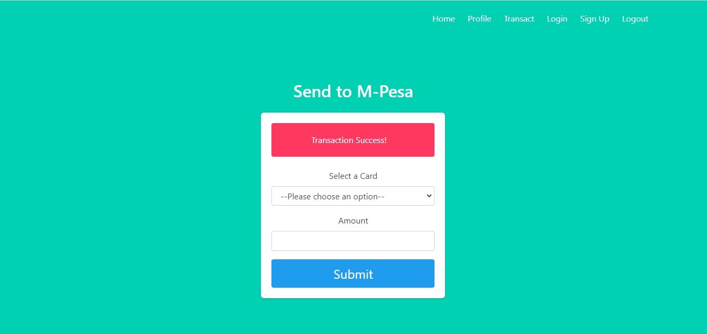

# Exchange
## A Dynamic Currency Exchange Application

### Pay via card in a variety of supported currencies and recieve KES via M-Pesa

# How It Works
1. Signup 



2. Add a card

**Note: The App currently runs in a sandbox environent. It is NOT advised to use a real card. Use one of the following cards offered by Global Payments, the Payment Gateway API used in this project**
- **VISA 5425230000004415**
- **MASTERCARD 4263970000005262**



3. Make a withdrawal



# TESTING LOCALLY

1. Clone this repository
`git clone https://github.com/awolcat/exchange.git`

2. Navigate to the root of the repository, create a virtual environment, and activate the virtual environment
```
$ cd exchange/
$ virtual env
$ source env/bin/activate
```

3. Install dependencies
`$ pip install requirements.txt`

4. Get the required API Credentials and fill them in the following starter script
*setup.sh*
```
#!/usr/bin/bash
# Setup environment including redis and mongo

# Export MPesa credentials - Consumer Key and Secret
export USERNAME=<your-daraja-consumer-key>
export PASSWORD=<your-daraja-consumer-secret>
export INITIATOR_PWD="Safaricom999!*!"

# Export Base URL MPesa transaction response urls:
export BASE_URL=<app-root-domain>

# Export GlobalPay creadentials:
export APP_ID=<your-globalpayments-appId>
export APP_KEY=<your-globalpayments-appkey>

# Export currencyapicom credential
export CURRENCY_API_KEY=<your-currencyapicom-apikey>

# Start mongo server
sudo service mongod start

# Start redis server
sudo service redis-server start
```

The BASE_URL environment variable is crucial because Mpesa Daraja API responds via a timeout and result url which
must be accessible over the internet.
> Ngrok and LocalTunnel are examples of HTTP tunneling clients that you could use to get a public IP and make your local host accessible over the internet.

5. Run the script
`$ source setup.sh`

6. In a seperate terminal, start your tunnelling service

7. From the root of the repository, run the app
`python3 -m app.app`

8. Enjoy!
